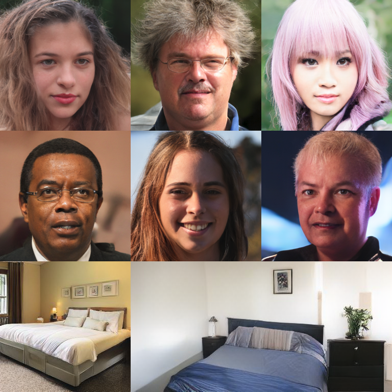

# Unleashing Transformers: Parallel Token Prediction with Discrete Diffusion Probabilistic Models for Fast High-Resolution Image Generation from Vector-Quantized Codes

This is the repository containing code used for the [Unleashing Transformers paper](www.google.com).



### Abstract
>   *Whilst diffusion probabilistic models can generate high quality image content, key limitations remain in terms of both generating high-resolution imagery and their associated high computational requirements. Recent Vector-Quantized image models have overcome this limitation of image resolution but are prohibitively slow and unidirectional as they generate tokens via element-wise autoregressive sampling from the prior. By contrast, in this paper we propose a novel discrete diffusion probabilistic model prior which enables parallel prediction of Vector-Quantized tokens by using an unconstrained Transformer architecture as the backbone. During training, tokens are randomly masked in an order-agnostic manner and the Transformer learns to predict the original tokens. This parallelism of Vector-Quantized token prediction in turn facilitates unconditional generation of globally consistent high-resolution and diverse imagery at a fraction of the computational expense. In this manner, we can generate image resolutions exceeding that of the original training set samples whilst additionally provisioning per-image likelihood estimates (in a departure from generative adversarial approaches). Our approach achieves state-of-the-art results in terms of Density (LSUN Bedroom: 1.51; LSUN Churches: 1.12; FFHQ: 1.20) and Coverage (LSUN Bedroom: 0.83; LSUN Churches: 0.73; FFHQ: 0.80), and performs competitively on FID (LSUN Bedroom: 3.64; LSUN Churches: 4.07; FFHQ: 6.11) whilst offering advantages in terms of both computation and reduced training set requirements.*

### Table of Contents

- [Unleashing Transformers: Parallel Token Prediction with Discrete Diffusion Probabilistic Models for Fast High-Resolution Image Generation from Vector-Quantized Codes](#unleashing-transformers-parallel-token-prediction-with-discrete-diffusion-probabilistic-models-for-fast-high-resolution-image-generation-from-vector-quantized-codes)
    - [Abstract](#abstract)
    - [Table of Contents](#table-of-contents)
  - [README To-Do](#readme-to-do)
  - [Setup](#setup)
    - [Install `conda` and `git`](#install-conda-and-git)
    - [Set up conda environment](#set-up-conda-environment)
    - [Hardware Requirements](#hardware-requirements)
    - [Dataset Set Up](#dataset-set-up)
  - [Commands](#commands)
    - [Set up visdom server](#set-up-visdom-server)
    - [Train a Vector-Quantized Image Model on FFHQ](#train-a-vector-quantized-image-model-on-ffhq)
    - [Train an Absorbing Diffusion sampler using the above Vector-Quantized autoencoder](#train-an-absorbing-diffusion-sampler-using-the-above-vector-quantized-autoencoder)
    - [Experiments on trained Absorbing Diffusion Sampler](#experiments-on-trained-absorbing-diffusion-sampler)
  - [Features To be Added](#features-to-be-added)


## README To-Do

- [ ] Dataset configuration guide
- [ ] Tidy commands and replace with commands non-NCC users will use.
  - [ ] Training commands
    - [ ] absorbing
    - [ ] autoregressive (?)
    - [ ] vqgan
  - [ ] metric collection
    - [ ] all in metric folder
- [ ] Add nice pictures to header
- [ ] Add actual paper link once on arxiv
- [x] Give conda setup tutorial
- [ ] Add pretrained models
- [ ] Get CUDA version on NCC
- [ ] Add credit
  - [ ] Taming Transformers code
  - [ ] MinGPT
  - [ ] NCC and Durham University(?)
- [ ] Include section on results (FID etc.)
- [x] Include abstract.
- [x] Update abstract
## Setup

### Install `conda` and `git`

**Conda**

If you already have a the conda tool available, you can skip this step.

The authors recommend setting up a virtual environment using [conda](https://docs.conda.io/en/latest/) to run the code in this repository. This will enable you to easily install the same python version and other package versions as those used to gather the experimental data included in the paper. It is possible to use other versions of python or even other virtual environment tools, but identical results cannot be guaranteed.

To get set up with conda quickly and easily, use [miniconda](https://docs.conda.io/en/latest/miniconda.html). It is available for most operating systems, is lightweight compared to the full version and should require no admin/sudo permissions. Installation instructions for minoconda are available [here](https://conda.io/projects/conda/en/latest/user-guide/install/index.html).

**Git CLI**

Most users will have git CLI installed on their system by default. But, if not, a good setup guide for most operating systems is available [here](https://git-scm.com/book/en/v2/Getting-Started-Installing-Git).

### Set up conda environment

In any folder of your choice, run the following command:
```
git clone https://github.com/samb-t/VQGAN-EBM.git && cd VQGAN-EBM
```
This will clone this repo into your local machine and cd into it.

Next, run:
```
conda create --name <env-name> --file requirements.txt
```
replacing `<env-name>` with your desired name for the environment. 

Finally, run:

```
conda activate <env-name>
```
You should now be able to run all commands available in the following sections.

### Hardware Requirements

Currently, a dedicated graphics card capable of running CUDA is required to run the code used in this repository. All models used for the paper were trained on a single NVIDIA RTX 2080ti using CUDA version <x.x.x.x>. The largest models still took less than a week to converge. 

It is ***not recommended*** that you attempt to run models on high-resolution datasets such as LSUN and FFHQ using only a CPU, as training will be very slow. Support for CPU-only training on small datasets may be added in the future. 

### Dataset Set Up
To configure the default paths for datasets used for training the models in this repo, simply edit `datasets.yaml` - changing the `paths` attribute of each dataset you wish to use to the path where your dataset is saved locally.

Download links for the datasets used in the paper are given below:

| Dataset | Download Links                                                                                     |
| ------- | -------------------------------------------------------------------------------------------------- |
| FFHQ    | [Academic Torrents](https://academictorrents.com/details/1c1e60f484e911b564de6b4d8b643e19154d5809) |
| LSUN    | [Academic Torrents](https://academictorrents.com/details/c53c374bd6de76da7fe76ed5c9e3c7c6c691c489)                                                                                             |

## Commands
This section contains details on the basic commands for training and calculating metrics on the Absorbing Diffusion models. All training was completed on a single 2080ti and these commands presume the same level of hardware. If your GPU has less vRAM than a 2080ti then you may need to train using smaller batch sizes and/or smaller models than the defaults.

For a detailed list of all commands options, including altering model architecture, logging output, checkpointing frequency, etc., please add the `--help` flag to the end of your command.

All commands should be run from the head directory, i.e. the directory containing the README file. 

### Set up visdom server

Before training, you'll need to start a visdom server in order to easily view model output (loss graphs, reconstructions, etc.). To do this, run the following command:

```
visdom -p 8097
```

This starts a visdom server listening on port 8097, which is the default used by our models. If you navigate to localhost:8097 you will see be able to view the live server.

To specify a different port when training any models, use the `--visdom_port` flag.

### Train a Vector-Quantized Image Model on FFHQ

The following command starts the training for a Vector-Quantized image model on FFHQ: 
```
python3 src/train_vqgan.py --dataset ffhq --log_dir vqae_ffhq --amp --batch_size 4
```

As specified with the `--log_dir` flag, results will be saved to the directory `logs/vqae_ffhq`. This includes all logs, model checkpoints and saved outputs. Also note the use of the `--amp` flag: this enables mixed-precision training, necessary for training using a batch size of 4 (the default) on a single 2080ti.

### Train an Absorbing Diffusion sampler using the above Vector-Quantized autoencoder

After training the Vector-Quantized model using the previous command for at least 100000 steps, you'll be able to run the following commands to train a discrete diffusion prior on the latent space of the Vector-Quantized model:

```
python3 src/train_sampler.py --sampler absorbing --dataset ffhq --log_dir absorbing_ffhq --ae_load_dir vqae_ffhq --ae_load_step 100000 --amp 
```

The sampler needs to load the trained Vector-Quantized autoencoder in order to generate the latents it will use as for training (and validation). 

### Experiments on trained Absorbing Diffusion Sampler

This section contains simple template commands for calculating metrics and other experiments on trained samplers.

**Calculate FID**

```
python src/calc_FID.py --sampler absorbing --dataset ffhq --log_dir FID_log --ae_load_dir vqae_ffhq --ae_load_step 100000  --load_dir absorbing_ffhq --load_step 100000 --n_samples 10000
```

**Calculate PRDC Scores**

```
python src/calc_PRDC.py --sampler absorbing --dataset ffhq --log_dir PRDC_log --ae_load_dir vqae_ffhq --ae_load_step 100000 --load_dir absorbing_ffhq --load_step 100000 --n_samples 10000
```


**Caclulate Negative Log Likelihood Estimations**

The following command optimises a Vector-Quantized autoencoder to compute NLL, and then evaluates the NLL of the trained sampler.

```
python src/calc_approximate_NLL.py --sampler absorbing --dataset ffhq --log_dir nll_ffhq --ae_load_dir vqae_ffhq --ae_load_step 100000 --load_dir absorbing_ffhq --load_step 100000 --steps_per_eval 5000 --train_steps 10000
```

NOTE: the `--steps_per_eval` flag is required for this script, as an validation dataset is used. 


**Generate Nearest Neighbours**

```
python src/calc_nearest_neighbours.py --sampler absorbing --dataset ffhq --log_dir nearest_neighbours_ffhq --ae_load_dir vqae_ffhq --ae_load_step 100000 --load_dir absorbing_ffhq --load_step 100000
```

**Generate Big Samples**

```
python src/generate_big_samples.py --sampler absorbing --dataset ffhq --log_dir big_samples_ffhq --ae_load_dir vqae_ffhq --ae_load_step 100000 load_dir absorbing_ffhq --load_step 100000 --shape 16 16
```

Use the `--shape` flag to specify the dimensions of the latents to generate.

## Features To be Added
This is a list of features that we hope to add in the near future:
- [ ] Tidier Code
- [ ] Centralised checkpointing
- [ ] Easier integration of new datasets